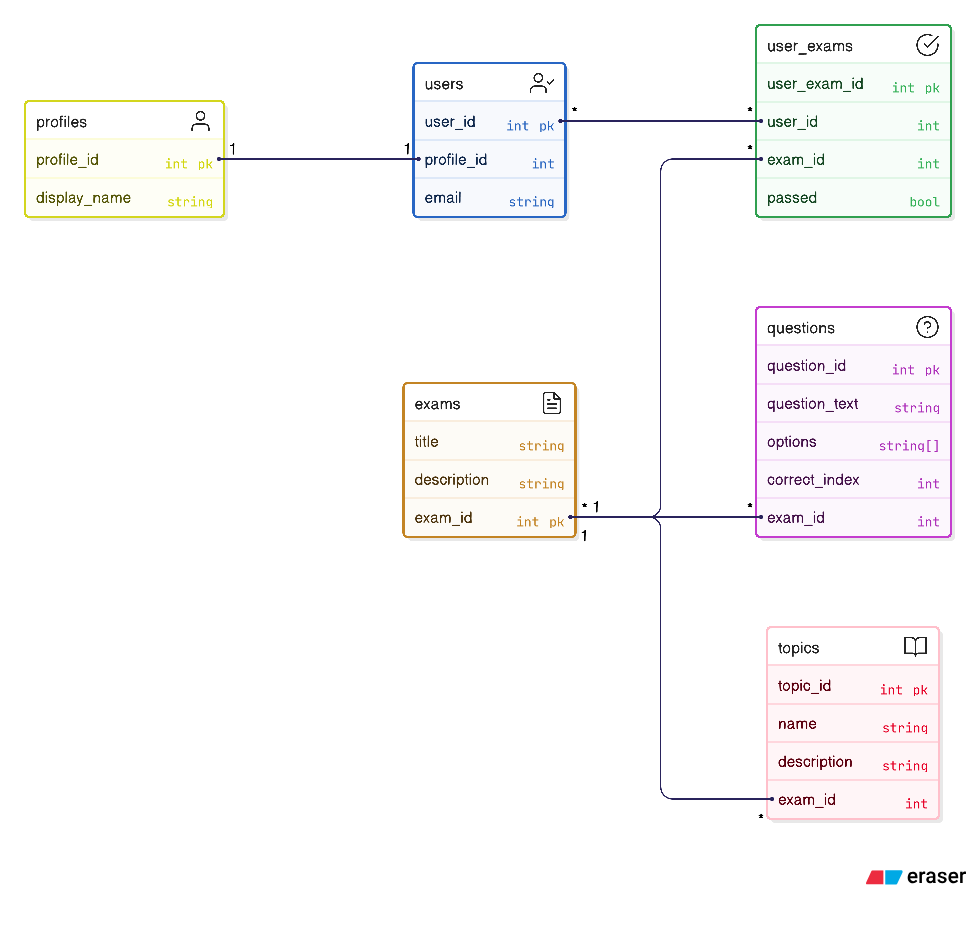

# Cloudy

Cloudy is the future of Microsoft cloud practice tests. 
Cloudy is built form the ground up with next-gen user identity orchestration through its PostgreSQL-powered synergy engine. 
Each test is designed precisley by the secret cloud cabal during the ritual of the cirrocumulous.
Each question is first written in their psedou-cloud derieved meta-language before being distilled down to human readable form.
All users of cloudy are garunteed positions at a MAANNG company with a starting salary of 3 million and access to web4.

With cloudy the forecast is permanetly overcast and you will see clouds on both horizons

## 🏗️ Build & Run Instructions

Follow these steps to summon Cloudy into existence on your machine:

### Clone the Repository
```bash
git clone https://github.com/yourusername/cloudy.git
cd cloudy
```

### Apply migrations
```bash
dotnet tool restore
dotnet ef migrations add InitialCreate
dotnet ef database update
```

### Run Cloudy
```bash
dotnet run
```

### ERD


